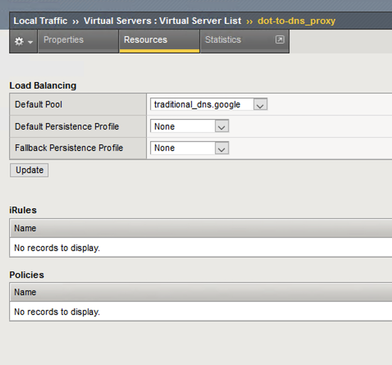
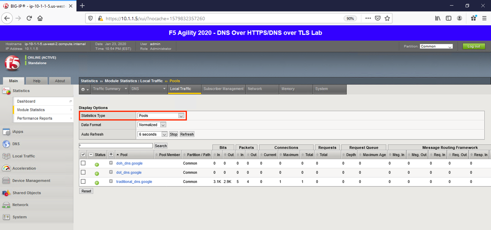

Proxying DNS over TLS Queries to Traditional DNS
------------------------------------------------

DoT-to-DNS is a bit more simplistic. We’re simply taking the existing
DNS request and encapsulating it in TLS. If you review the virtual
server configuration, you’ll notice that we’re simply using a client-SSL
profile and a backend pool. No iRule magic needed here; just classic
BIG-IP high-performance SSL offloading.

**The client-SSL profile on this virtual server specifies that SSL/TLS
termination should occur on the client side of the connection.**

Virtual Server Configuration
~~~~~~~~~~~~~~~~~~~~~~~~~~~~

Maximize *Firefox*. Notice the virtual server for DoT-to-DNS is very
simple:

|image11.png|

Clicking on *Resources* tab on the top navigation bar will show that the
virtual server has a simple pool and no iRules attached.

|image12.png|

.. _test-drive-1:

Test Driving DNS over TLS to Traditional DNS
~~~~~~~~~~~~~~~~~~~~~~~~~~~~~~~~~~~~~~~~~~~~

Let’s return to the desktop and launch the Lab DNS Server client. You’ll
be automagically logged in. Let’s run a DNS over TLS query:

kdig +tls @10.1.10.100 www.f5.com

|image13.png|

Viewing Statistics for DoT-to-DNS
~~~~~~~~~~~~~~~~~~~~~~~~~~~~~~~~~

You can then see statistics on the virtual server by navigating to
**Statistics** -> **Module Statistics** -> **Local Traffic** and
selecting *Virtual Servers* in the drop-down list.

|image14.png|

Because this virtual server is taking advantage of backend pools, you
will see statistics under the *Pools* statistics type as well.

|image15.png|

Because we don’t have any type of logging configured for that virtual
server, you won’t see any information in **System** -> **Logs** for this
traffic. Conventional F5 logging/statistics practices can be used for
these connections, so we’ll move on.

.. _packet-capture-1:

Capturing DNS over TLS to Traditional DNS Traffic
~~~~~~~~~~~~~~~~~~~~~~~~~~~~~~~~~~~~~~~~~~~~~~~~~

Maximize the BIG-IP CLI window. Execute the follow tcpdump command:

tcpdump -nni 0.0 port 53 or port 853

Return to the Ubuntu Jump Host and re-run your **kdig** command. Observe
the front and back-end connections using port 853 and 53, respectively.

|image16.png|

Stop your capture before moving on to the next section. This concludes
the DoT-to-DNS portion of the lab.

.. |image1.png| image:: _images/image1.png
   :width: 7.5in
   :height: 5.29969in
.. |image2.png| image:: _images/image2.png
   :width: 7.5in
   :height: 4.6875in
.. |image3.png| image:: _images/image3.png
   :width: 7.5in
   :height: 4.6875in
.. |image4.png| image:: _images/image4.png
   :width: 7.5in
   :height: 4.47917in
.. |image5.png| image:: _images/image5.png
   :width: 7.5in
   :height: 4.48438in
.. |image6.png| image:: _images/image6.png
   :width: 7.5in
   :height: 4.4775in
.. |image7.png| image:: _images/image7.png
   :width: 2.39879in
   :height: 2.88051in
.. |image8.png| image:: _images/image8.png
   :width: 7.5in
   :height: 4.47917in
.. |image9.png| image:: _images/image9.png
   :width: 7.5in
   :height: 4.47917in
.. |image10.png| image:: _images/image10.png
   :width: 7.5in
   :height: 3.89006in
.. |image11.png| image:: _images/image11.png
   :width: 7.5in
   :height: 4.47917in
.. |image12.png| image:: _images/image12.png
   :width: 7.5in
   :height: 4.47396in
.. |image13.png| image:: _images/image13.png
   :width: 7.5in
   :height: 4.47917in
.. |image14.png| image:: _images/image14.png
   :width: 7.5in
   :height: 4.54167in
.. |image15.png| image:: _images/image15.png
   :width: 7.5in
   :height: 4.47917in
.. |image16.png| image:: _images/image16.png
   :width: 7.5in
   :height: 4.47917in
.. |image17.png| image:: _images/image17.png
   :width: 7.5in
   :height: 4.47917in
.. |image18.png| image:: _images/image18.png
   :width: 7.5in
   :height: 4.47917in
.. |image19.png| image:: _images/image19.png
   :width: 7.5in
   :height: 3.19271in
.. |image20.png| image:: _images/image20.png
   :width: 7.5in
   :height: 3.74479in
.. |image21.png| image:: _images/image21.png
   :width: 7.5in
   :height: 2.85417in
.. |image22.png| image:: _images/image22.png
   :width: 7.5in
   :height: 3.51563in
.. |image23.png| image:: _images/image23.png
   :width: 7.5in
   :height: 3.46314in
.. |image24.png| image:: _images/image24.png
   :width: 7.5in
   :height: 3.48958in
.. |image25.png| image:: _images/image25.png
   :width: 7.5in
   :height: 4.47396in
.. |image26.png| image:: _images/image26.png
   :width: 2.75in
   :height: 6.40278in
.. |image27.png| image:: _images/image27.png
   :width: 7.5in
   :height: 4.55208in
.. |image28.png| image:: _images/image28.png
   :width: 7.5in
   :height: 10in

.. |image30.png| image:: _images/image30.png
   :width: 7.5in
   :height: 4.76136in

.. |image34.png| image:: _images/image34.png
   :width: 7.5in
   :height: 4.37598in
.. |image35.png| image:: _images/image35.png
   :width: 7.5in
   :height: 3.49479in
.. |image36.png| image:: _images/image36.png
   :width: 7.5in
   :height: 3.46875in
.. |image37.png| image:: _images/image37.png
   :width: 7.5in
   :height: 4.47396in
.. |image38.png| image:: _images/image38.png
   :width: 7.5in
   :height: 2.99202in
.. |image39.png| image:: _images/image39.png
   :width: 7.5in
   :height: 3.50243in
.. |image40.png| image:: _images/image40.png
   :width: 7.5in
   :height: 3.59375in
.. |image41.png| image:: _images/image41.png
   :width: 7.5in
   :height: 1.45278in

