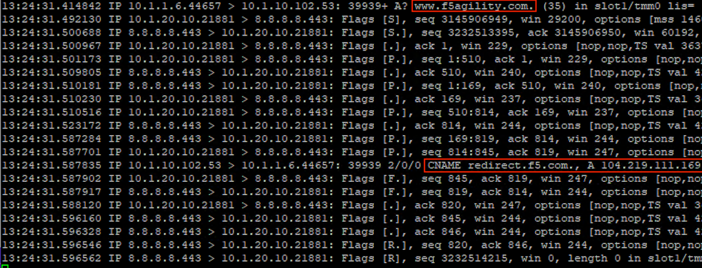

Proxying Traditional DNS queries to DNS over HTTPS
--------------------------------------------------

Finally, let’s look at converting a DNS query to a DoH request.

.. _test-drive-3:

Test Driving Traditional DNS to DNS over HTTPS
~~~~~~~~~~~~~~~~~~~~~~~~~~~~~~~~~~~~~~~~~~~~~~

We’ll once again use **kdig** as we’re simply generating a traditional
DNS request.

kdig @10.1.10.102 `www.f5agility.com <http://www.f5agility.com>`__

You’ll get a response as shown below:

|image21.png|

.. _viewing-statistics-2:

Viewing Statistics for DNS-to-DoH
~~~~~~~~~~~~~~~~~~~~~~~~~~~~~~~~~

Back on the BIG-IP, we’ll see connections on the DNS-to-DoH virtual
server:

|image22.png|

If we set the statistics type to *iRulesLX*, we’ll see RPC connections
on the iRule for this translation:

|image23.png|

.. _packet-capture-3:

Capturing Traditional DNS to DNS over HTTPS Traffic
~~~~~~~~~~~~~~~~~~~~~~~~~~~~~~~~~~~~~~~~~~~~~~~~~~~

Running a packet capture, we can see the front-end udp/53 requests being
translated to DoH requests:

tcpdump -nni 0.0 (host 10.1.10.102 and port 53) or (host 8.8.4.4 or host
8.8.8.8 and port 443)

**If your packet capture is “noisy,” removing the HTTPS monitor from the
“doh_google.dns” pool will stop the intermittent queries.**

Notice that a port 53 request comes in, a HTTPS connection is set up and
the query is passed, then the port 53 response is sent to the client
before the HTTPS connection is torn down.

|image24.png|

This concludes the hands-on portion of the lab. Feel free to explore and
test the environment if there is time remaining.

.. |image1.png| image:: _images/image1.png
   :width: 7.5in
   :height: 5.29969in
.. |image2.png| image:: _images/image2.png
   :width: 7.5in
   :height: 4.6875in
.. |image3.png| image:: _images/image3.png
   :width: 7.5in
   :height: 4.6875in
.. |image4.png| image:: _images/image4.png
   :width: 7.5in
   :height: 4.47917in
.. |image5.png| image:: _images/image5.png
   :width: 7.5in
   :height: 4.48438in
.. |image6.png| image:: _images/image6.png
   :width: 7.5in
   :height: 4.4775in
.. |image7.png| image:: _images/image7.png
   :width: 2.39879in
   :height: 2.88051in
.. |image8.png| image:: _images/image8.png
   :width: 7.5in
   :height: 4.47917in
.. |image9.png| image:: _images/image9.png
   :width: 7.5in
   :height: 4.47917in
.. |image10.png| image:: _images/image10.png
   :width: 7.5in
   :height: 3.89006in
.. |image11.png| image:: _images/image11.png
   :width: 7.5in
   :height: 4.47917in
.. |image12.png| image:: _images/image12.png
   :width: 7.5in
   :height: 4.47396in
.. |image13.png| image:: _images/image13.png
   :width: 7.5in
   :height: 4.47917in
.. |image14.png| image:: _images/image14.png
   :width: 7.5in
   :height: 4.54167in
.. |image15.png| image:: _images/image15.png
   :width: 7.5in
   :height: 4.47917in
.. |image16.png| image:: _images/image16.png
   :width: 7.5in
   :height: 4.47917in
.. |image17.png| image:: _images/image17.png
   :width: 7.5in
   :height: 4.47917in
.. |image18.png| image:: _images/image18.png
   :width: 7.5in
   :height: 4.47917in
.. |image19.png| image:: _images/image19.png
   :width: 7.5in
   :height: 3.19271in
.. |image20.png| image:: _images/image20.png
   :width: 7.5in
   :height: 3.74479in
.. |image21.png| image:: _images/image21.png
   :width: 7.5in
   :height: 2.85417in
.. |image22.png| image:: _images/image22.png
   :width: 7.5in
   :height: 3.51563in
.. |image23.png| image:: _images/image23.png
   :width: 7.5in
   :height: 3.46314in
.. |image24.png| image:: _images/image24.png
   :width: 7.5in
   :height: 3.48958in
.. |image25.png| image:: _images/image25.png
   :width: 7.5in
   :height: 4.47396in
.. |image26.png| image:: _images/image26.png
   :width: 2.75in
   :height: 6.40278in
.. |image27.png| image:: _images/image27.png
   :width: 7.5in
   :height: 4.55208in
.. |image28.png| image:: _images/image28.png
   :width: 7.5in
   :height: 10in
.. |image29.png| image:: _images/image29.png
   :width: 7.5in
   :height: 6.98222in
.. |image30.png| image:: _images/image30.png
   :width: 7.5in
   :height: 4.76136in
.. |image31.png| image:: _images/image31.png
   :width: 7.5in
   :height: 3.45313in
.. |image32.png| image:: _images/image32.png
   :width: 7.5in
   :height: 3.51563in
.. |image33.png| image:: _images/image33.png
   :width: 7.5in
   :height: 4.49479in
.. |image34.png| image:: _images/image34.png
   :width: 7.5in
   :height: 4.37598in
.. |image35.png| image:: _images/image35.png
   :width: 7.5in
   :height: 3.49479in
.. |image36.png| image:: _images/image36.png
   :width: 7.5in
   :height: 3.46875in
.. |image37.png| image:: _images/image37.png
   :width: 7.5in
   :height: 4.47396in

